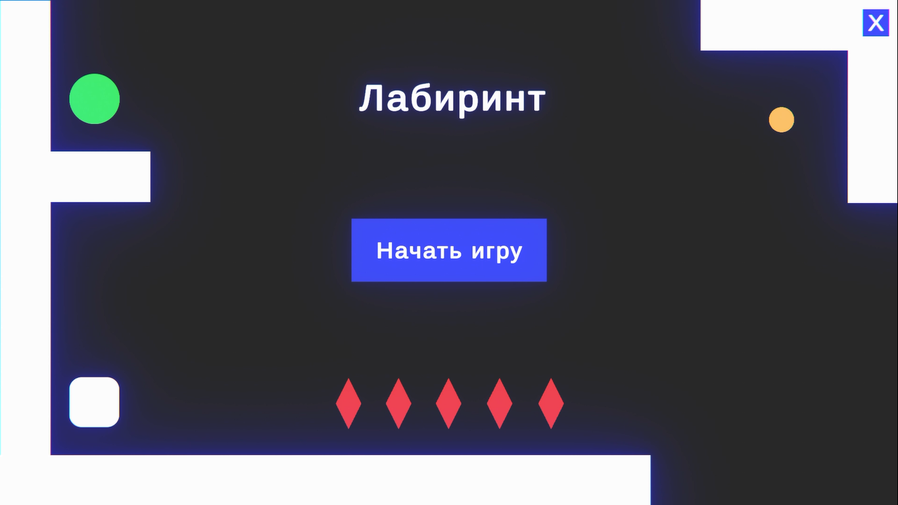
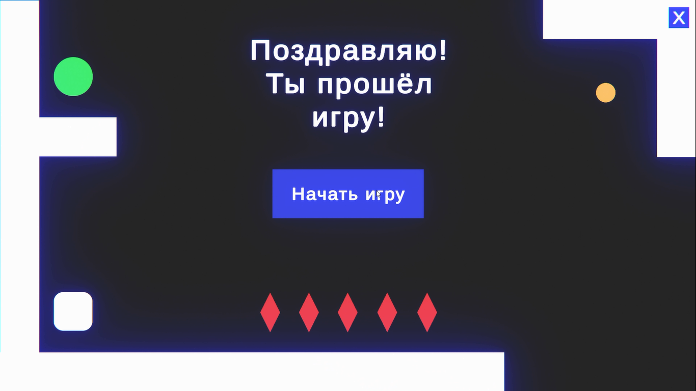
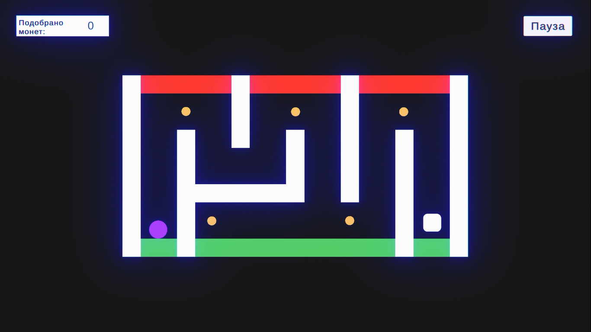
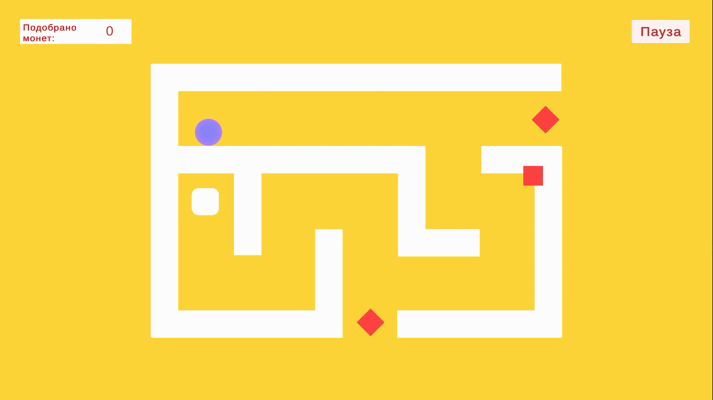
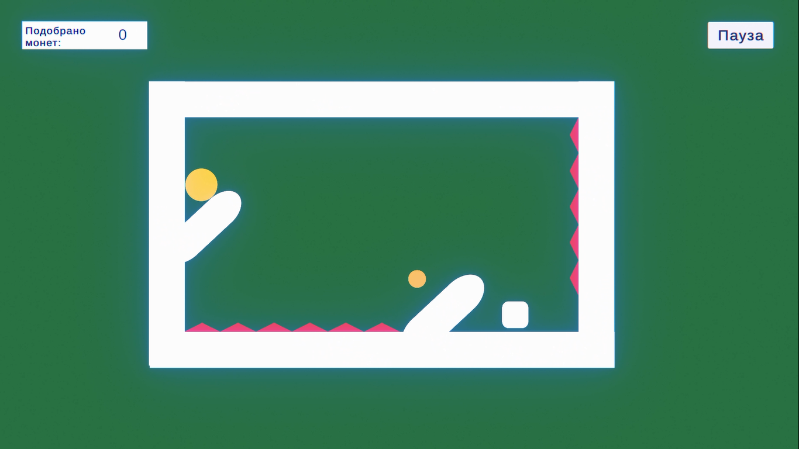
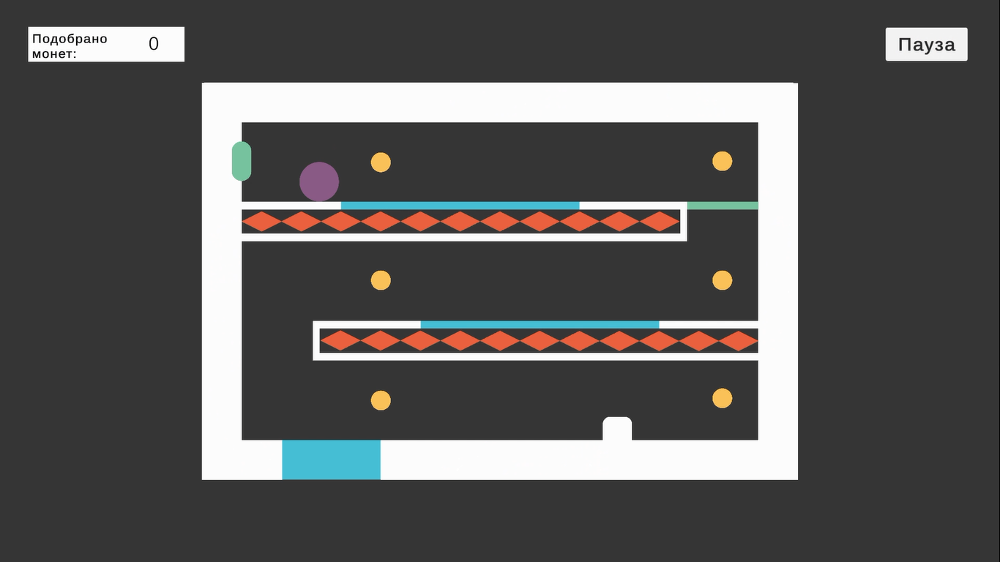
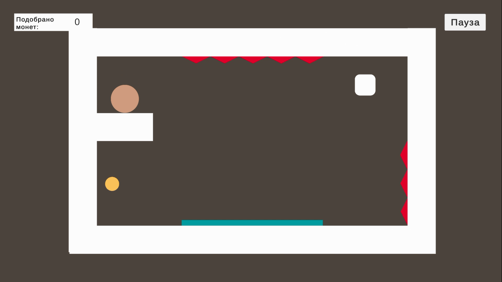
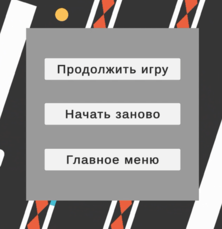

# maze
# Описание проекта
Игра представляет собой двухмерный физический лабиринт, реализованный в среде Unity. Игрок изменяет положение игрового поля, поворачивая сцену с помощью клавиш управления. Это воздействие приводит к изменению направления силы тяжести, в результате чего шарик движется по лабиринту под действием физики.

Цель игрока — пройти пять уровней, избегая препятствий и собирая монеты. Некоторые уровни включают специальные интерактивные элементы, такие как ключи, открывающие двери, и батута, усиливающего движение шара.

Каждый уровень сопровождается фоновой музыкой и звуками взаимодействия, загруженными с Asset Store и интегрированными с помощью компонентов AudioSource. На каждом уровне реализован отдельный интерфейс счёта монет, а также меню паузы с возможностью перезапуска, выхода в главное меню и продолжения игры.

# Реализация
В проекте использовались инструменты Unity 2D для создания сцен, настройки физики и организации взаимодействий между объектами. Игровая механика реализована на языке C# с использованием transform.Rotate для поворота сцены и компонента Rigidbody2D, благодаря которому шар движется под действием силы тяжести. Взаимодействие с объектами настроено с помощью тегов, а обработка коллизий осуществляется через методы OnTriggerEnter2D и OnCollisionEnter2D. На одном из уровней предусмотрен батут, реализованный с использованием компонента Physics Material 2D, обеспечивающего дополнительную упругость при столкновении.

Игровой процесс построен на физике: игрок направляет шар, изменяя положение сцены, преодолевая препятствия и собирая монеты. Структура проекта включает главное меню, пять уровней и финальный экран с сообщением о прохождении. В каждом уровне отображается счётчик собранных монет, а также реализовано меню паузы с кнопками перезапуска, продолжения игры и выхода в главное меню. Аудиосопровождение включает фоновую музыку и звуки взаимодействия, добавленные с помощью AudioSource; все аудиофайлы загружены с Unity Asset Store.

# Скриншоты
## Интерфейс, кнопка меню

## Уровни
| 1 | 2 | 
|----------|--------|
|  |  
| 3 | 4 |
|----------|--------|
|  | 
| 5 | Пауза |
|----------|--------|
|  | 
